# 贡献指南

首先, **感谢您愿意贡献您的对话记录**.

## 文件格式

本仓库支持的聊天记录文件格式为`jsonl`文件, 以下是其内部格式, 其中列出的字段为必需项:

```jsonl
{"user_name": "<name>", "character_name": "<char>"}
{"system": "<system>"}
{"name": "<role name>", "mes": "<message>"}
{"name": "<role name>", "mes": "<message>"}
...
```

解释:

- 第一行, 必须要有`user_name`和`character_name`字段.
- 第二行, 必须要有`system`字段.
- 第三行及以后, 必需要有`name`和`mes`字段.

## 生成/导出聊天记录文件

您可以将其他地方的优质数据集转化为上文要求的格式然后提交, 但我更推荐使用[SillyTavern](https://github.com/SillyTavern/SillyTavern)导出您的聊天数据为`jsonl`格式的文件, 因为这样只需要对文件做微小的改动即可符合本仓库要求的数据格式.

如果您选择使用[SillyTavern](https://github.com/SillyTavern/SillyTavern)导出的数据, 则请按如下步骤添加`system`字段:

1. 找到这段聊天对应的角色卡.
2. 复制其**角色描述**框中的所有内容, 可能是多行文字.
3. 在本仓库的目录下找到`trans.py`文件, 将其打开.
4. 找到如下字段:

    ```python
    input_text = """
    <将此替换为你复制的角色卡信息>
    <substitute this to character card info which you copied>
    """
    ```

    将您复制的角色描述信息复制到对应的地方. **请注意, 在提交/上传文件前必须将`trans.py`恢复到未更改的状态**, 否则无法被自动识别. 如果您仅使用网页版提交/上传文件, 则无需注意.
5. 运行如下命令:

    ```shell
    python trans.py
    ```

6. 您将会在终端中看到转换完成的文本, 将其全部复制.
7. 打开您的聊天记录文件, 新增**第二行**为空行, 插入如下文本:

    ```json
    {"system": "此处替换为您刚刚复制的文本"}
    ```

8. 保存文件并退出

现在, 您已经成功构建了符合要求的聊天记录文件.

## 上传聊天记录文件

请fork一份本仓库到您的名下, 从仓库目录中打开`data`文件夹, 将您的聊天记录文件上传到该文件夹中, 然后向本仓库提交**Pull Request**. 如果您之前fork过本仓库, 请确保在您上传文件**之前同步您的fork**, 以免造成索引错误而无法通过自动检测.

如果一切正常, 您的Pull Request将会自动被合并到本仓库中, 之后您可以安全地删除您创建的fork.

## 逐步指南

如果您对以上信息仍有疑问, 可以遵循这个逐步指南来提交您的聊天记录文件.

### 0. 克隆本仓库

在您想存放本仓库的位置打开命令行终端, 输入以下命令:

```shell
git clone https://github.com/Orion-zhen/roleplay-dataset.git
```

本仓库即被克隆到当前目录的`roleplay-dataset`文件夹下.

### 1. 创建您的fork

首先点击页面上方的fork按钮:

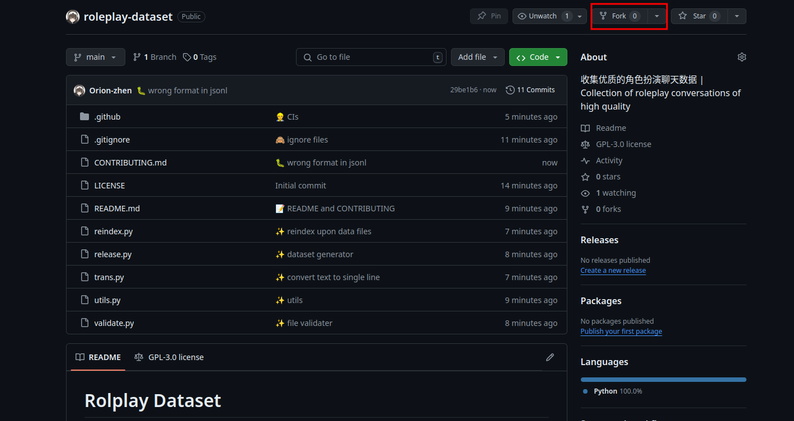

然后点击`Create fork`.

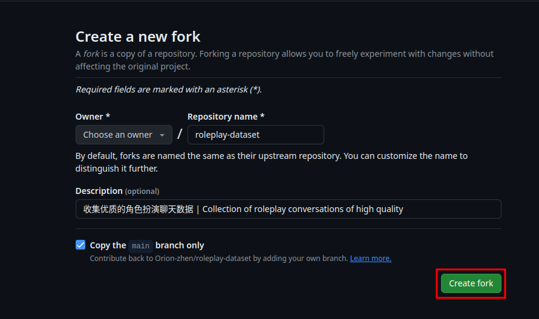

### 2. 从SillyTavern中导出聊天记录

首先运行SillyTavern, 打开对应的网页.

然后打开角色栏目, 选择一个角色:

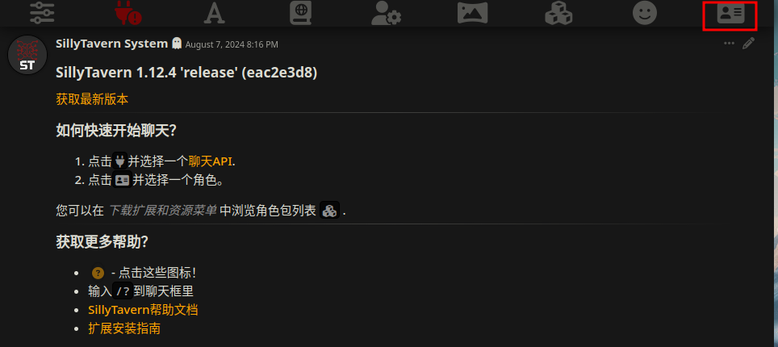

在聊天界面中, 找到输入框左侧的三根横线:

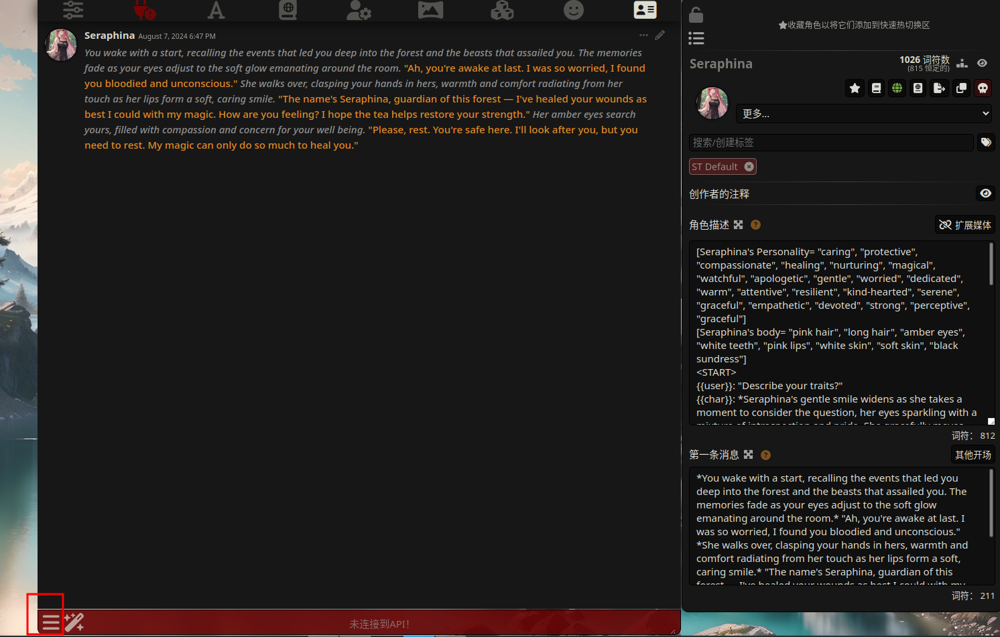

在弹出的选项框中, 选择管理聊天文件:

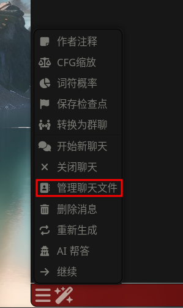

在弹出的选项框中, 选择导出聊天记录(jsonl格式):

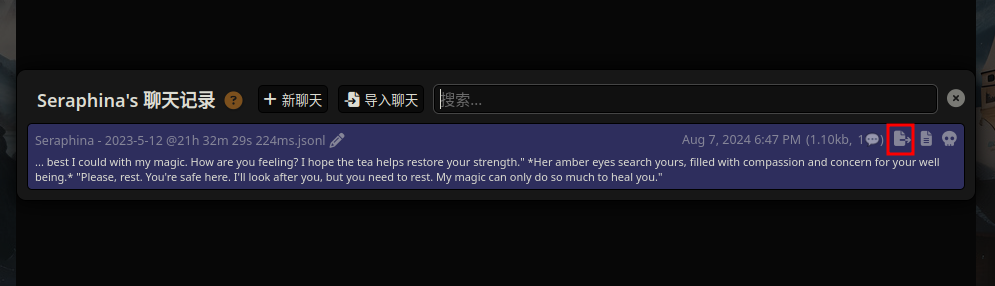

### 3. 修改数据格式

在角色信息栏中, 全选角色描述栏中的文本, 复制:

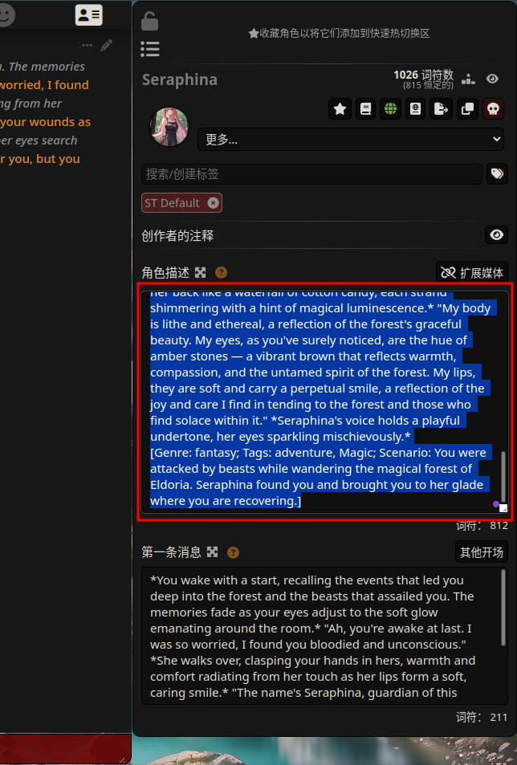

转到您克隆的本仓库所在的路径, 找到`trans.py`, 打开它.

然后找到`input_text`所在的位置, 将其中的内容用您之前复制的角色描述覆盖掉:

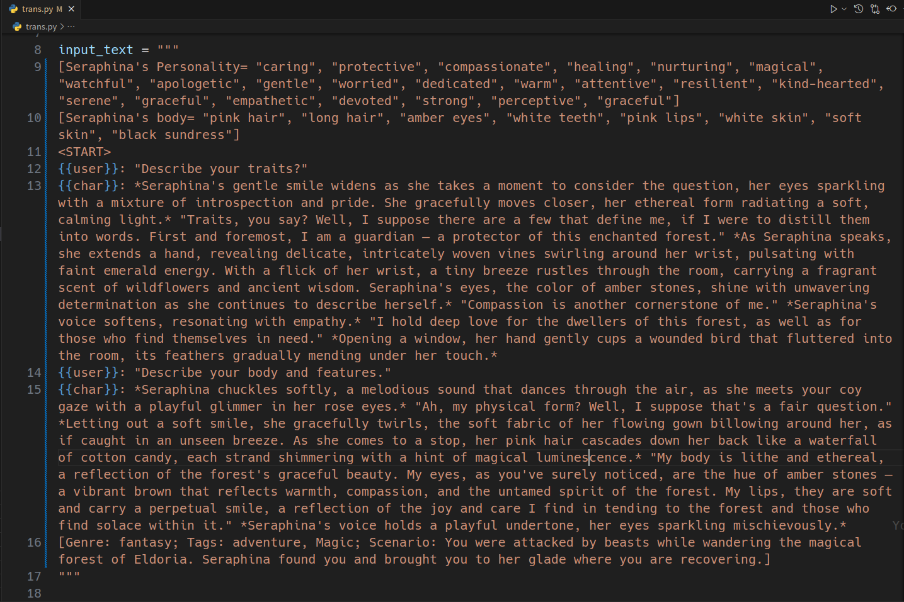

在这个目录下打开命令行终端, 输入命令:

```shell
python trans.py
```

您会看到命令行中输出了一大段文字. 将其全部复制:

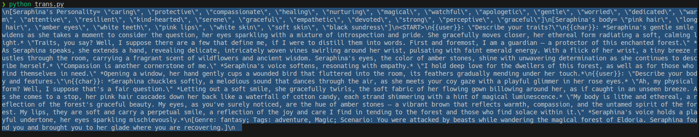

找到您之前导出的聊天记录文件所在的位置(常见于浏览器的下载目录中), 使用记事本或其他文本编辑器将其打开, 然后在**第二行**新增一个空行:


输入如下文本:

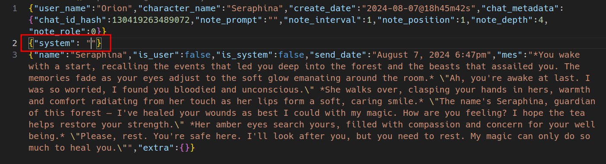

最后, 将您之前从命令行中复制的文字粘贴到`""`中:

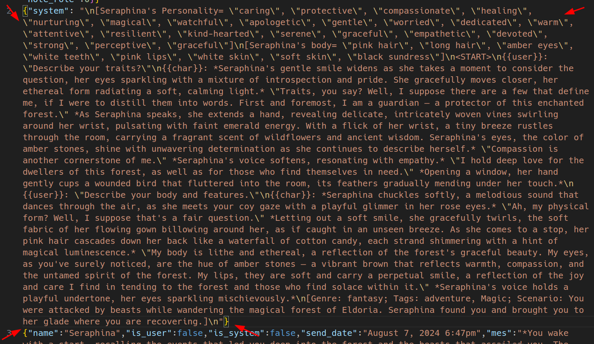

### 4. 上传文件

找到您之前创建的fork, 点击`data`文件夹:

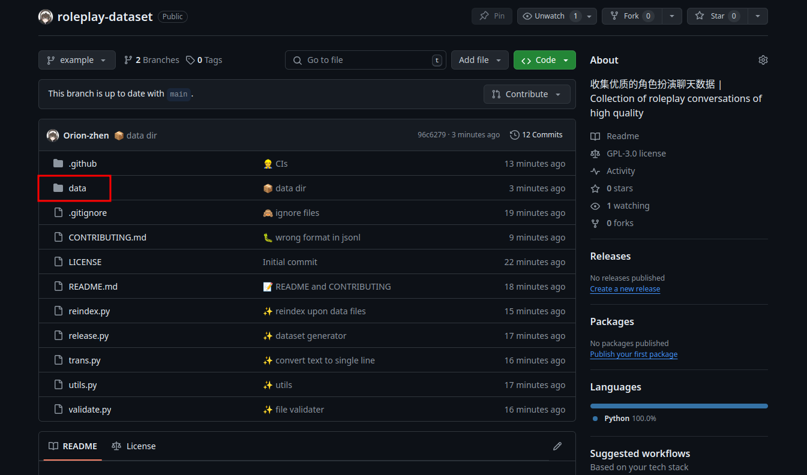

在`data`文件夹中, 依次点击`Add file`按钮和`Upload files`选项:

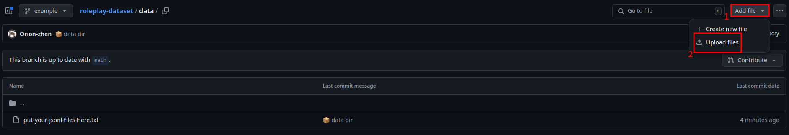

上传您的文件, 如果您有多个文件, 可以一起上传:


更改提交信息(如果您愿意的话), 然后提交:

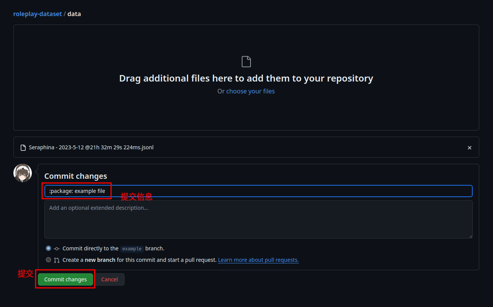

回到您的仓库的首页, 依次点击`Contribute`按钮和`Open pull request`按钮:

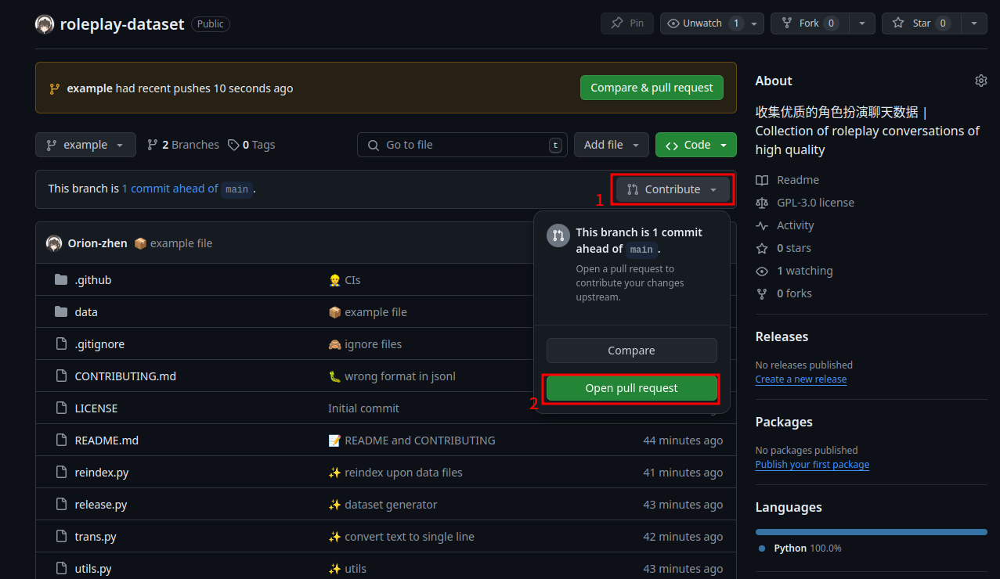

在弹出的页面中, 点击`Create pull request`按钮:

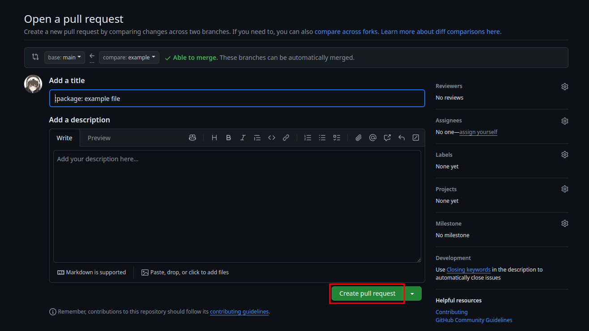

您的Pull Request就成功创建了. 您将能看到您的文件正在自动地被检查格式是否符合要求等:

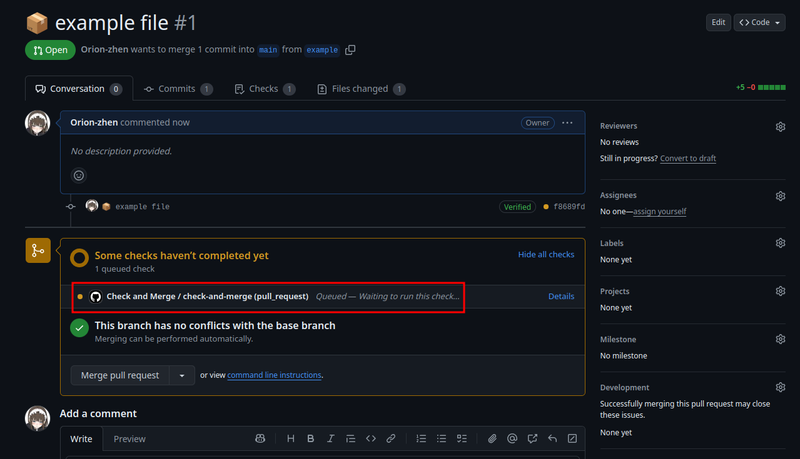

如果一切正常, 您将很快就能看到您的Pull Request被成功合并, 您成功地向本仓库提交了一份聊天记录文件.

---

感谢您对本仓库的贡献.
